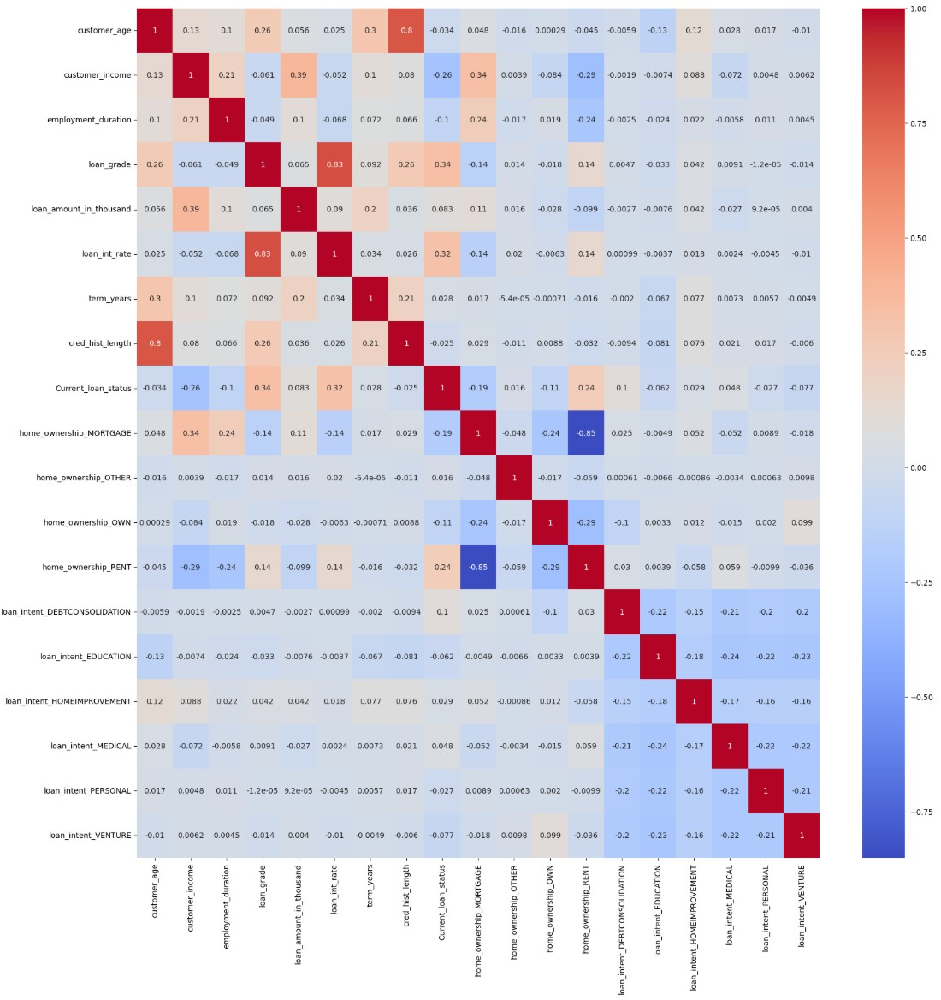
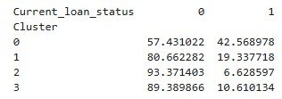
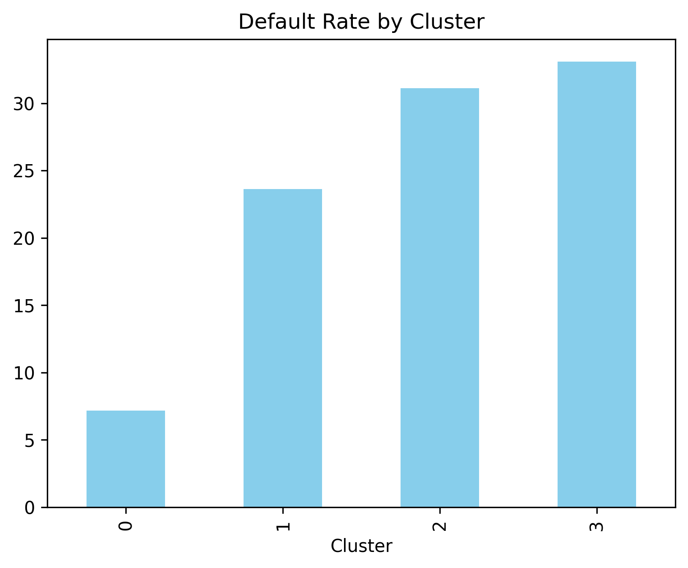
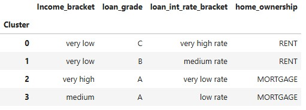
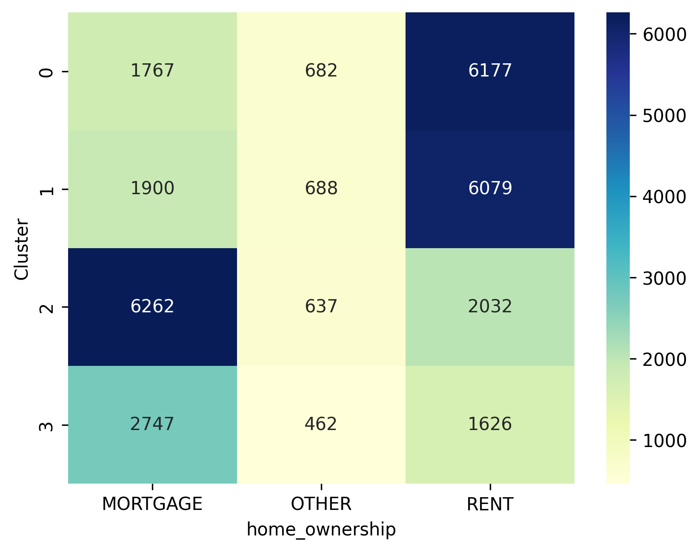
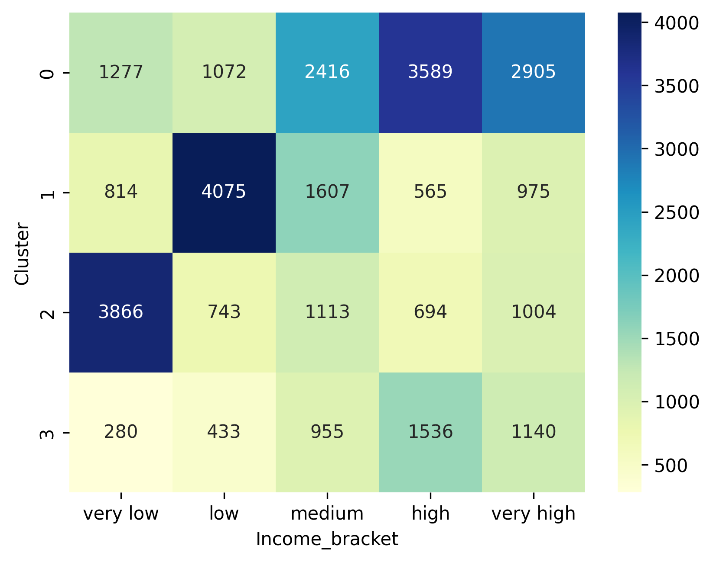
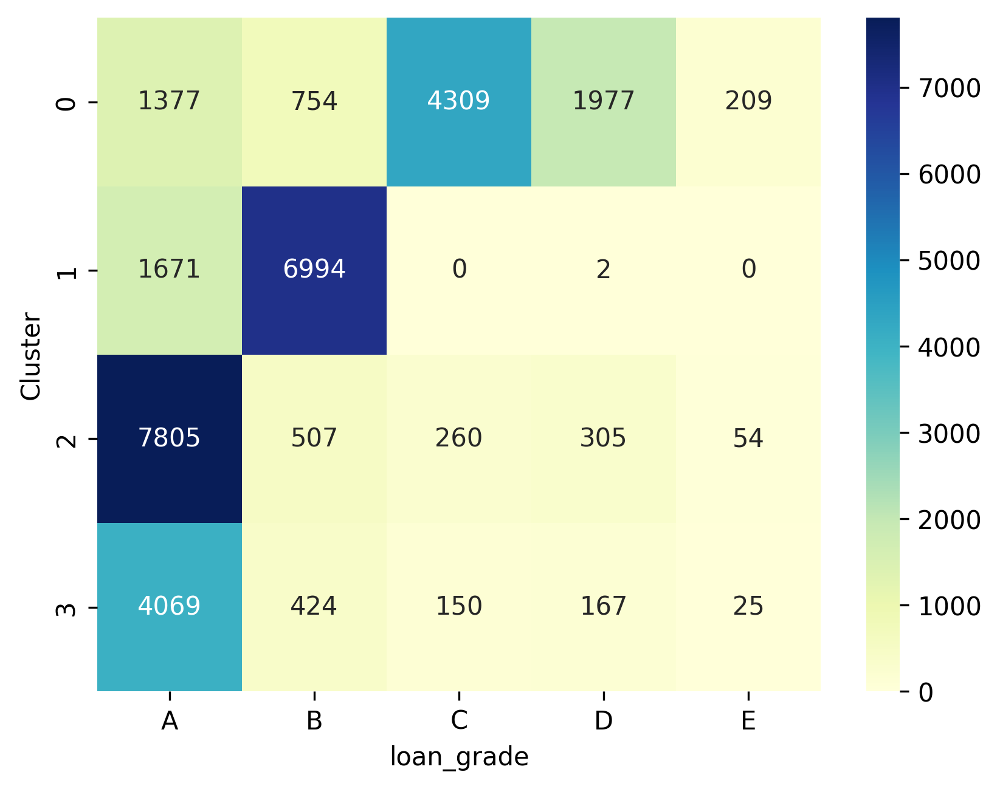
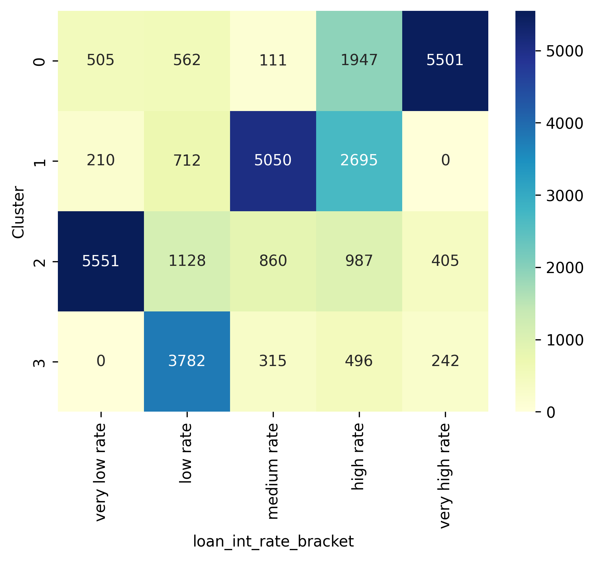

## 🏦 Loan Repayment Clustering: Understanding Borrower Risk

Exploring which customer groups are more likely to repay loans late using unsupervised learning.

## Project Story
Every loan tells a story.
Behind repayment patterns lie human circumstances — income, housing, opportunity.

In this project, I explored how those factors cluster together and what they reveal about loan repayment risk. The goal wasn’t to predict individual defaulters, but to understand which borrower profiles carry more risk, helping lenders make fairer, more informed decisions.

## Objective

*Question: Can we segment borrowers into meaningful groups and identify which groups are most likely to repay loans late?*

This analysis combines data storytelling and unsupervised machine learning to uncover repayment patterns from categorical data.

## Data & Methodology
Dataset is downloaded from this link:
https://www.kaggle.com/datasets/prakashraushan/loan-dataset

1. Data Preparation: handelling mising values, duplicated rows, inconsistant format, encoding categorical features such as *customer_income,loan_intent, loan_grade, interest_rate_bracket, and home_ownership*.
2. Feature Selection:	Chose features correlated with current_loan_status by using *spearman method*.
3. Clustering:	Used K-Modes, a categorical clustering algorithm, to group similar borrowers.
4. Evaluation:	Compared late-repayment percentages across clusters and validated results using a chi-square test.
5. Visualization:	Used bar charts and heatmaps to summarize patterns across groups.

## Key Findings

| Cluster | Customer Profile                                      | % Late Repayment | Interpretation                                                      |
| ------- | ----------------------------------------------------- | ---------------- | ------------------------------------------------------------------- |
| **0**   | Very Low income, Grade C, Very high interest, Rent    | **42.57%**        | 🔴 High risk – financially stretched borrowers with expensive loans |
| **1**   | Very Low income , Grade B, Medium interest, Rent   | 19.34%            | 🟠 Moderate risk – decent income but high living costs              |
| **3**   | Medium income , Grade A, Low interest, Mortgage           | 10.61%            | 🟢 Lower risk – safer loans but financially limited                 |
| **2**   | Very High income , Grade A, Very low interest, Mortgage | **6.63%**         | 🟢 Very low risk – stable borrowers with affordable loans           |

*Noted that Grade A is the highest (A>B>C>D>E)*

## Visual Summary

##### Correlation Matrix

##### Default Rate by Cluster

*Default rate for each cluster in %. 0= No Default, 1= Default*

##### Cluster Feature Profile:

Table:

Heatmap:

The contrast between Cluster 0 and Cluster 2 visually highlights how income, loan terms, and housing status interact to influence repayment reliability.

## Insights & Business Impact

- Borrowers with low income and rental housing show the highest likelihood of late repayment, especially when loan grades and rates are unfavourable.
- Borrowers with mortgages and higher income consistently show the lowest repayment risk.
- The segmentation provides a risk map — lenders can use this to adjust loan offers, monitor at-risk groups, or design early-warning systems.

## Reflection

This project reminded me that clustering isn’t just math — it’s a lens on human behaviour.
The data revealed how financial conditions, opportunity, and risk are quietly connected.
As a data scientist, my goal was to translate these patterns into insights a business leader can act on.

## Tools
Python, pandas, kmodes, matplotlib, seaborn, Chi-square, numpy
